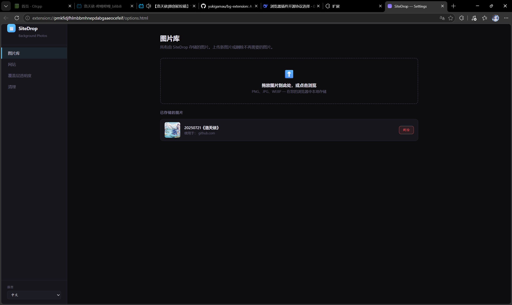
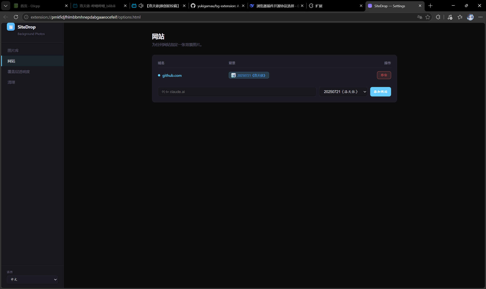
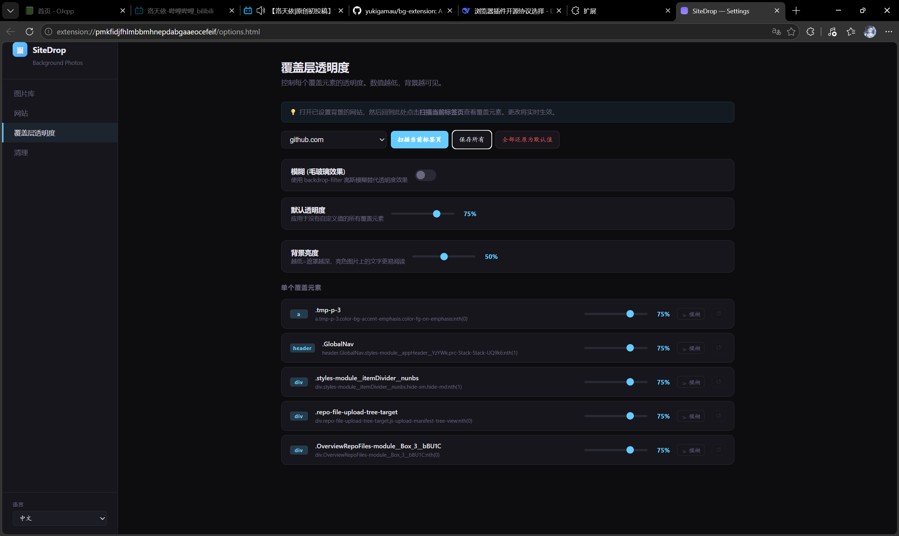
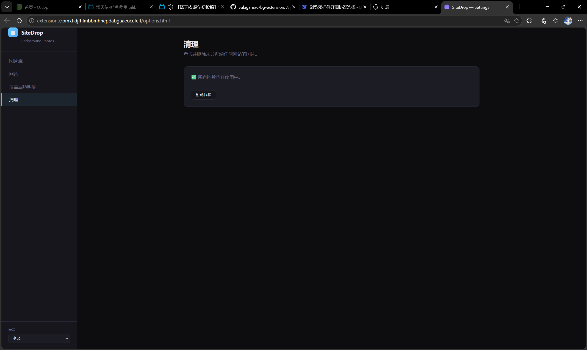
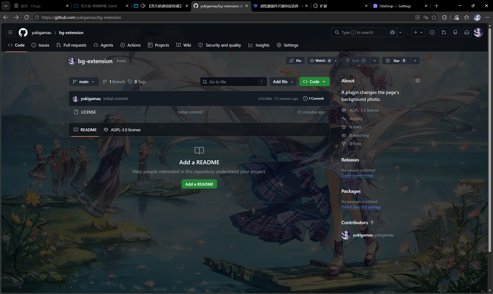
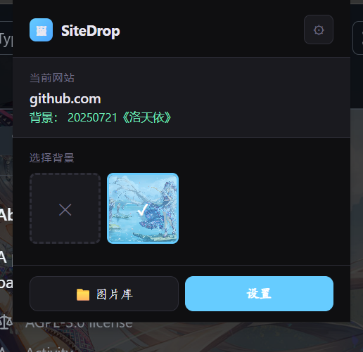

# AI
Yes, this pulgin uses AI.
# SiteDrop — Background Photos

> A Chrome extension that lets you set custom background photos for any website.
> 一款可以为任意网站设置自定义背景图片的 Chrome 扩展。

---

## Features / 功能

| English | 中文 |
|---|---|
| Set any image as page background for specific sites | 为指定网站设置任意图片作为页面背景 |
| Cover opacity control — make large background elements semi-transparent | 覆盖层透明度调节 — 让大块背景元素半透明 |
| **Gaussian blur (Glassmorphism)** — per-element backdrop-filter blur instead of transparency | **高斯模糊 (毛玻璃效果)** — 逐元素使用 backdrop-filter 模糊替代透明 |
| **Background brightness** — dim overly bright images with a dark overlay | **背景亮度** — 通过黑色遮罩降低过亮图片的亮度 |
| Improved cover detection — catches fixed/sticky navbars, edge-anchored UI controls | 改进的覆盖层检测 — 捕获 fixed/sticky 导航栏、边缘控件 |
| Photo Library management — upload, preview, delete | 图片库管理 — 上传、预览、删除 |
| Site-photo mapping — assign a photo to each domain | 网站-图片映射 — 为每个域名分配图片 |
| Unused photo cleanup | 未使用图片清理 |
| **Multi-language support** — English & 中文 (简体) | **多语言支持** — English & 中文 |
| All data stored locally in `chrome.storage` | 所有数据存储在 `chrome.storage` 本地 |

---

## Screenshots / 截图

> 
> 
> 
> 
> 
>  

**Popup** — quick background selection for the current site.
**Options / 设置** — Photo Library, Site mapping, Cover Opacity controls, Cleanup.

---

## Installation / 安装

### Chrome Web Store (Coming Soon / 即将上线)

### Manual Install / 手动安装

1. Download or clone this repository.
   下载或克隆本仓库。

2. Open Chrome and go to `chrome://extensions`, or edge [Microsoft Edge extension](https://microsoftedge.microsoft.com/addons/Microsoft-Edge-Extensions-Home)
   打开 Chrome，访问 `chrome://extensions`，或者[Microsoft Edge 加载项](https://microsoftedge.microsoft.com/addons/Microsoft-Edge-Extensions-Home)

3. Enable **Developer mode** (toggle in top-right).
   开启**开发者模式**（右上角开关）。

4. Click **Load unpacked** and select the `bg-extension` folder.
   点击**加载已解压的扩展**，选择 `bg-extension` 文件夹。

5. The extension icon will appear in your toolbar.
   扩展图标将出现在工具栏。

---

## Usage / 使用指南

### Quick Start / 快速开始

1. Click the extension icon in the toolbar to open the **popup**.
   点击工具栏扩展图标打开**弹窗**。

2. The current site's hostname is shown at the top.
   顶部显示当前网站的域名。

3. Choose a photo from the grid to set it as the background for this site.
   从网格中选择一张图片作为该网站的背景。

4. Click **✕** to remove the background from this site.
   点击 **✕** 取消该网站的背景。

### Settings Page / 设置页面

Click the **⚙** icon in the popup, or the **Settings** button, to open the full options page.
点击弹窗中的 **⚙** 图标或 **Settings** 按钮打开完整设置页面。

#### Photo Library / 图片库

- Upload images via drag & drop or click-to-browse.
  通过拖放或点击上传图片。
- Supported formats: PNG, JPG, WEBP.
  支持的格式：PNG、JPG、WEBP。
- Each photo shows which sites are using it.
  每张图片显示其被哪些网站使用。
- Delete unused photos from the list.
  从列表中删除未使用的图片。

#### Sites / 网站

- Add a domain and assign a photo to it.
  添加域名并分配图片。
- View all configured site-photo mappings.
  查看所有已配置的网站-图片映射。
- Remove a site mapping at any time.
  随时移除网站映射。

#### Cover Opacity / 覆盖层透明度

This is the core feature for making backgrounds look great.
这是让背景看起来效果出色的核心功能。

1. Open a site that has a background photo set.
   打开已设置背景图片的网站。

2. Go to the **Cover Opacity** tab.
   切换到 **Cover Opacity** 标签页。

3. Select the site from the dropdown and click **Scan active tab**.
   从下拉菜单中选择网站，点击 **Scan active tab**。

4. The extension scans the page and finds **covering elements** — large `<div>`s or UI sections that have opaque backgrounds and would hide your photo.
   扩展会扫描页面，找出**覆盖元素**——那些有不透明背景的大块 `<div>` 或 UI 区域。

5. Adjust opacity via sliders — lower values make them more transparent so your background shows through.
   通过滑块调节透明度——数值越低越透明，背景图越可见。

**Per-element controls / 逐元素控制：**
- Each detected cover has its own slider.
  每个检测到的覆盖层有独立的滑块。
- **🌫 Blur** button enables `backdrop-filter: blur()` for a frosted-glass effect (great for white/light backgrounds).
  **🌫 Blur** 按钮开启毛玻璃效果（适用于白色/浅色背景）。
- **↺ Reset** reverts the element to the global default.
  **↺ Reset** 还原到全局默认值。

**Brightness / 亮度：**
- Lower the **Background brightness** slider to dim a bright image via a dark overlay, making white/gray text readable.
  降低**背景亮度**滑块，通过黑色遮罩降低亮图的亮度，让白/灰色文字变得可读。

**Batch reset / 批量还原：**
- Click **Reset all to defaults** to remove all per-element overrides at once.
  点击 **Reset all to defaults** 一次清除所有逐元素覆盖设置。

#### Cleanup / 清理

- Scan for photos not assigned to any site and remove them all at once.
  扫描未分配给任何网站的图片并一键删除。

---

## Project Structure / 项目结构

```
bg-extension/
├── _locales/
│   ├── en/messages.json      # English manifest strings
│   └── zh/messages.json       # 中文 manifest 字符串
├── icons/
│   ├── icon16.png
│   ├── icon48.png
│   └── icon128.png
├── content.js                 # Content script: applies backgrounds & cover detection
├── i18n.js                    # Multi-language engine (内嵌翻译字典)
├── manifest.json              # Chrome extension manifest
├── options.html               # Full settings page (设置页面)
├── options.js                 # Settings page logic
├── popup.html                 # Popup UI (弹窗界面)
├── popup.js                   # Popup logic
└── README.md                  # This file
```

---

## Technical Highlights / 技术要点

### Cover Detection / 覆盖层检测

Three-tier detection strategy / 三级检测策略：

| Level | Condition | Catches |
|---|---|---|
| #1 Large cover | ≥85% viewport | Page main sections |
| #2 Fixed/Sticky | `position: fixed` or `sticky` | Navbars, headers |
| #3 Edge-anchored | Solid background + within 80px of viewport edge | Sidebars, bottom bars, floating controls |

### Brightness Dimming / 亮度调节

A fixed-position `<div id="__sitedrop_dim__">` with `z-index: -1` sits between the html background and page content. Its `rgba(0,0,0, 1-brightness)` background acts as a dark overlay that dims only the background image without affecting text readability.
使用 `z-index: -1` 的固定定位遮罩层，位于 html 背景和页面内容之间，通过黑色半透明叠加只降低背景图亮度，不影响文字可读性。

### Multi-language / 多语言

- Built-in `i18n.js` engine with embedded translation dictionaries, no external file loading needed.
  内嵌翻译字典的 i18n 引擎，无需外部加载。
- Language can be switched via dropdown in the settings sidebar.
  设置页面侧边栏可切换语言。
- Preference stored in `chrome.storage.local`.
  偏好设置存储在 `chrome.storage.local`。

### Data Flow / 数据流

```
┌─────────┐    ┌──────────────┐    ┌──────────────┐
│ popup   │───→│ chrome.storage│←──→│ options page │
└─────────┘    └──────┬───────┘    └──────────────┘
                      │
               ┌──────▼───────┐
               │  content.js  │ ← applies settings to page
               └──────────────┘
```

---

## Color Theme / 配色方案

The extension's own UI uses a dark blue theme:
扩展自身界面采用深色蓝色主题：

| Variable | Value | Usage |
|---|---|---|
| `--accent` | `#66ccff` | Primary blue |
| `--accent2` | `#4da6ff` | Hover state |
| `--bg` | `#0d0d10` / `#0f0f11` | Page background |
| `--surface` | `#16161c` / `#1a1a1f` | Card/surface |
| `--border` | `#2a2a36` | Borders |
| `--text` | `#e8e6f0` | Text color |
| `--muted` | `#6b6880` | Subdued text |

---

## Privacy / 隐私

- **No data is sent to any server.** All photos and settings are stored locally in `chrome.storage.local`.
  **不向任何服务器发送数据。** 所有图片和设置均存储在本地 `chrome.storage.local`。
- The `scripting` and `tabs` permissions are only used to apply the background image to the page you're viewing.
  `scripting` 和 `tabs` 权限仅用于将背景图片应用到您当前浏览的页面。
- `host_permissions: <all_urls>` is required because you can set backgrounds for any website.
  `host_permissions: <all_urls>` 是必需的，因为您可以为任何网站设置背景。

---

## License / 许可

MIT License — feel free to use, modify, and distribute.
MIT 许可 — 可自由使用、修改和分发。

---

## Contributing / 贡献

Issues and pull requests are welcome!
欢迎提交 Issue 和 Pull Request！

- Found a bug? [Open an issue]
  发现 Bug？[提交 Issue]
- Want a feature? [Start a discussion]
  想要新功能？[发起讨论]
- PRs should follow the existing code style (no linter config needed).
  PR 请遵循现有代码风格（无需额外配置 linter）。
